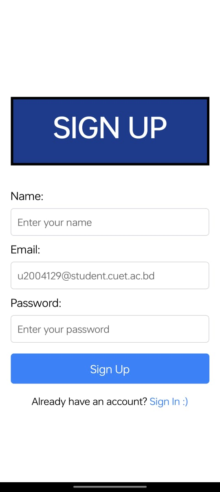
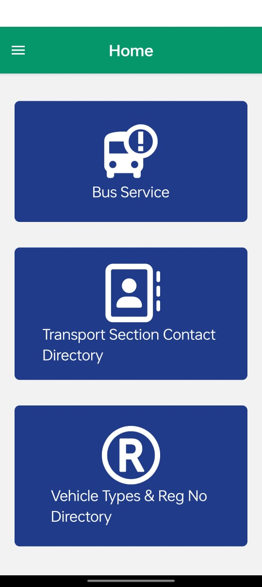
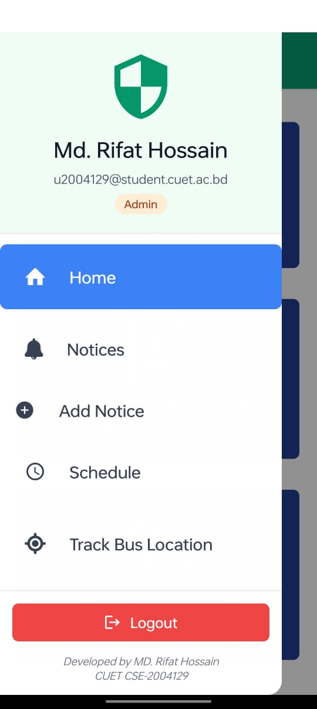
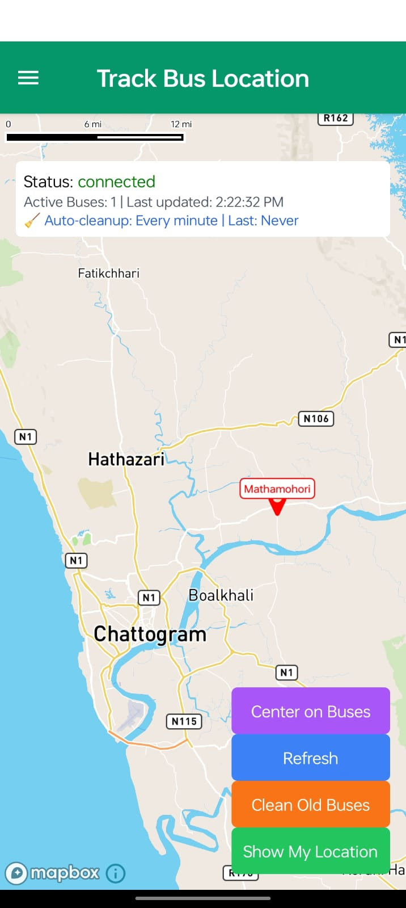
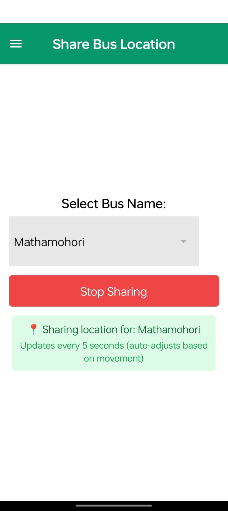
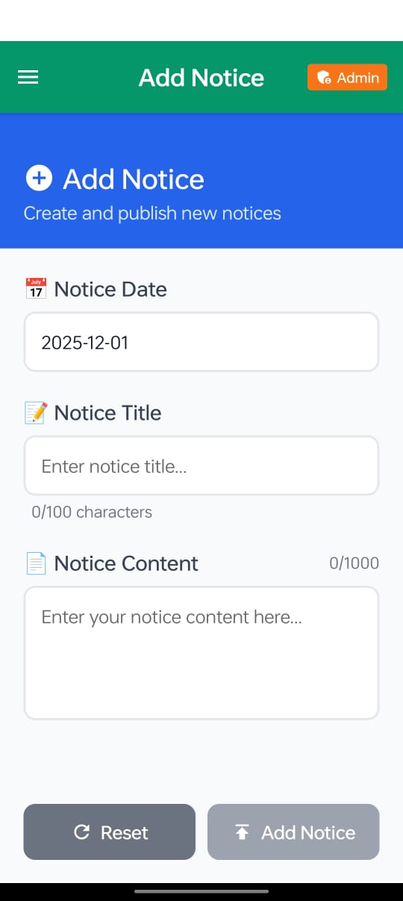
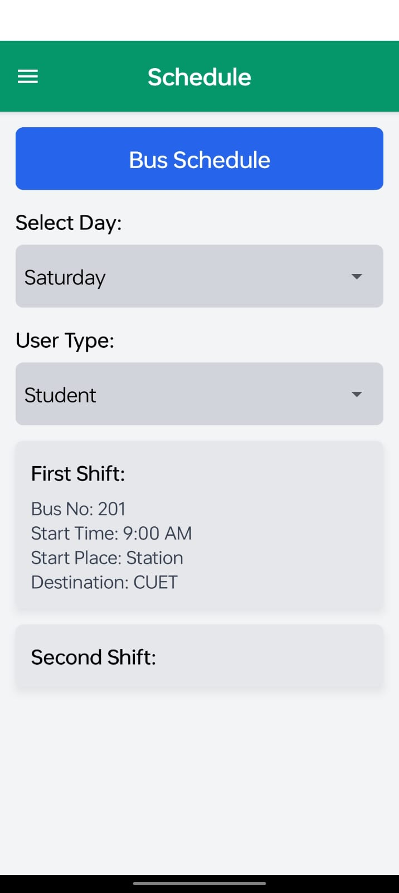
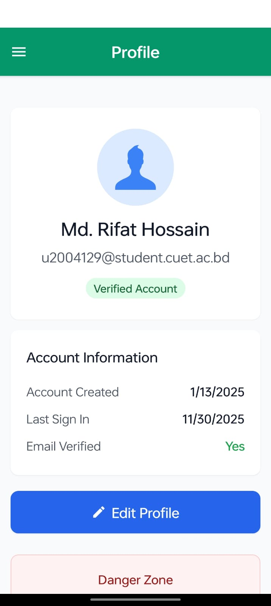
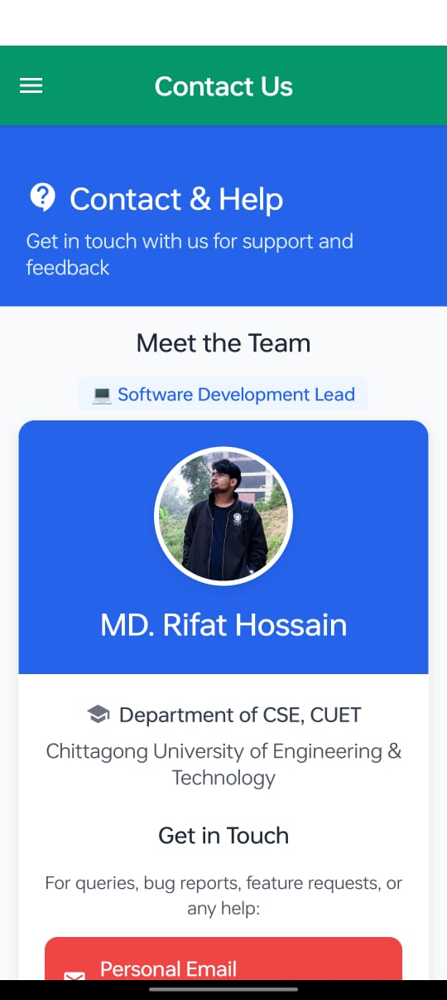

# 🚌 MyCUETBus - Real-Time University Bus Tracking System

<div align="center">


**Track CUET buses in real-time, share locations, and never miss your ride!**

[](https://github.com/rifathossain47/MyCUETBus/releases)
[](https://www.android.com/)
[](LICENSE)
[](https://mycuetbus.web.app/)
[](https://www.figma.com/design/vQ2w1PHp8utaXXKp5U1dHc/MyCUETBus-Design?node-id=0-1&t=hopklNfZRpoQyAO3-1)

[Download APK](https://mycuetbus.web.app/) • [Figma Design](https://www.figma.com/design/vQ2w1PHp8utaXXKp5U1dHc/MyCUETBus-Design?node-id=0-1&t=hopklNfZRpoQyAO3-1) • [Documentation](#-installation) • [View Demo](#-screenshots)

</div>

# Important

To Check the App, you can use this account:
Email: u2004129@student.cuet.ac.bd
Password: asdfgh

---

## 📖 About

**MyCUETBus** is a comprehensive real-time bus tracking solution designed specifically for Chittagong University of Engineering & Technology (CUET) students and staff. The app bridges the gap between students waiting for buses and drivers/conductors operating them.

### 🎯 Problem it Solves

- Students waste time waiting for buses with unknown arrival times
- No visibility into bus locations or routes
- Difficulty coordinating transportation schedules

### ✨ Solution

MyCUETBus provides real-time GPS tracking with:

- 🗺️ **Live Map View** - See all active buses on an interactive Mapbox map
- 📍 **Background Location Sharing** - Drivers share location even when app is minimized
- 🔔 **Real-Time Updates** - Location updates every 5 seconds via Firebase
- 📅 **Bus Schedules** - View departure times and routes
- 🔐 **Secure Authentication** - Firebase Auth with email verification
- 👥 **Student-Only Access** - CUET email domain restriction (@student.cuet.ac.bd)

---

## 📸 Screenshots

<div align="center">

### Authentication & Onboarding

<table>
  <tr>
    <td align="center">
      
      <br/>
      <b>Splash Screen</b>
    </td>
    <td align="center">
      
      <br/>
      <b>Sign In</b>
    </td>
    <td align="center">
      
      <br/>
      <b>Sign Up</b>
    </td>
    <td align="center">
      
      <br/>
      <b>Home Page</b>
    </td>
    <td align="center">
      
      <br/>
      <b>Dashboard</b>
    </td>
    
  </tr>
</table>

### Main Features - Track Bus

<table>
  <tr>
    <td align="center">
      
      <br/>
      <b>Track Bus Map</b>
    </td>
  </tr>
</table>

### Share Location Feature

<table>
  <tr>
    <td align="center">
      
      <br/>
      <b>Share Location</b>
    </td>
  </tr>
</table>

### Notice

<table>
  <tr>
    <td align="center">
      
      <br/>
      <b>Notice</b>
    </td>
    <td align="center">
      
      <br/>
      <b>Add Notice</b>
    </td>
  </tr>
</table>

### Schedule & Profile

<table>
  <tr>
    <td align="center">
      
      <br/>
      <b>Bus Schedule</b>
    </td>
    <td align="center">
      
      <br/>
      <b>Profile</b>
    </td>
    <td align="center">
      
      <br/>
      <b>Contact Us</b>
    </td>
  </tr>
</table>

</div>

---

## 🎨 Design

The app's UI/UX was carefully designed in Figma before development. View the complete design system, mockups, and prototypes:

🔗 **[View Figma Design File](https://www.figma.com/design/vQ2w1PHp8utaXXKp5U1dHc/MyCUETBus-Design?node-id=0-1&t=hopklNfZRpoQyAO3-1)**

**Design Highlights:**

- 🎨 Complete UI component library
- 📱 High-fidelity mockups for all screens
- 🔄 Interactive prototypes
- 🎯 Consistent design system with colors, typography, and spacing
- ♿ Accessibility considerations

---

## 📥 Download

### 🔗 Official Release

- **Website**: [mycuetbus.web.app](https://mycuetbus.web.app/)
- **GitHub Releases**: [Download Latest APK](https://github.com/rifathossain47/MyCUETBus/releases)
- **Google Play Store**: _Coming Soon_

### 📱 Requirements

- Android 10.0 (API 29) or higher
- ~40-60 MB storage space
- Internet connection for real-time tracking
- GPS/Location services enabled

---

## ✨ Features

### 🎓 For Students

- **Track Buses** - View all active buses on a real-time map
- **Bus Locations** - See exact GPS coordinates with accuracy indicators
- **Bus Details** - Speed, heading, last update timestamp
- **Route Information** - View bus schedules and timings
- **Developer Profiles** - Meet the team behind the app

### 🚍 For Drivers/Conductors

- **Share Location** - One-tap location sharing with foreground service
- **Background Updates** - Continues sharing even when app is minimized or screen is off
- **Battery Optimized** - Efficient location updates every 5 seconds
- **Start/Stop Control** - Easy toggle for sharing status
- **Visual Feedback** - Persistent notification while sharing

### 🔧 For Admins

- **Verify Users** - Approve/reject student registrations
- **Manage Access** - Control who can use the app
- **Monitor Activity** - View active buses and sharing sessions

---

## 🛠️ Tech Stack

### Frontend

- **Framework**: React Native 0.76.5 with Expo SDK 52
- **Navigation**: Expo Router (file-based routing)
- **UI Library**: NativeWind (Tailwind CSS for React Native)
- **State Management**: React Hooks + Context API
- **Maps**: @rnmapbox/maps (Mapbox GL JS for React Native)

### Backend

- **Database**: Firebase Realtime Database
- **Authentication**: Firebase Auth with email/password
- **Hosting**: Firebase Hosting (web version)
- **Storage**: Firebase Storage (for assets)

### Location Services

- **GPS Tracking**: expo-location with background task support
- **Background Tasks**: expo-task-manager
- **Persistence**: @react-native-async-storage/async-storage

### Build & Deploy

- **Build System**: EAS Build (Expo Application Services)
- **CI/CD**: GitHub Actions (optional)
- **Version Control**: Git + GitHub

---

## 🚀 Installation

### Prerequisites

- Node.js 18+ and npm/yarn
- Android Studio (for local builds)
- Expo CLI: `npm install -g expo-cli`
- EAS CLI: `npm install -g eas-cli`

### Setup

1. **Clone the repository**

   ```bash
   git clone https://github.com/rifathossain47/MyCUETBus.git
   cd MyCUETBus
   ```

2. **Install dependencies**

   ```bash
   npm install
   ```

3. **Configure environment variables**
   Create a `.env` file in the root directory:

   ```env
   MAPBOX_DOWNLOADS_TOKEN=sk.your_mapbox_downloads_token
   MAPBOX_API=pk.your_mapbox_public_token
   ```

4. **Set up Firebase**

   - Create a Firebase project at [console.firebase.google.com](https://console.firebase.google.com)
   - Enable Authentication (Email/Password)
   - Enable Realtime Database
   - Download `google-services.json` → place in `android/app/`
   - Update `firebase.config.js` with your credentials:
     ```javascript
     const firebaseConfig = {
       apiKey: "YOUR_API_KEY",
       authDomain: "YOUR_AUTH_DOMAIN",
       databaseURL: "YOUR_DATABASE_URL",
       projectId: "YOUR_PROJECT_ID",
       storageBucket: "YOUR_STORAGE_BUCKET",
       messagingSenderId: "YOUR_MESSAGING_SENDER_ID",
       appId: "YOUR_APP_ID",
     };
     ```

5. **Run development build**
   ```bash
   npx expo start
   ```
   Then press `a` for Android or scan QR with Expo Go app.

---

## 📂 Project Structure

```
MyCUETBus/
├── app/                          # Expo Router pages
│   ├── tabs/                     # Tab navigation screens
│   │   ├── trackBus.jsx          # Real-time bus tracking map
│   │   ├── shareLocation.jsx     # Location sharing for drivers
│   │   ├── schedule.jsx          # Bus schedules
│   │   └── profile.jsx           # User profile & settings
│   ├── tasks/                    # Background tasks
│   │   └── backgroundLocationTask.js  # Location sharing worker
│   ├── _layout.jsx               # Root layout with auth guard
│   └── index.jsx                 # App entry point
├── components/                   # Reusable UI components
│   ├── profilecard.jsx           # Developer profile cards
│   ├── signIN.jsx                # Login screen
│   ├── signUP.jsx                # Registration screen
│   └── adminVerification.jsx     # Admin approval screen
├── assets/                       # Static assets
│   ├── images/                   # App icons, logos, images
│   ├── screenshots/              # App screenshots (12 images)
│   └── Splash Screen.png         # Splash screen
├── android/                      # Native Android configuration
│   ├── app/
│   │   ├── src/main/AndroidManifest.xml  # Permissions & services
│   │   ├── build.gradle          # Build config with ProGuard
│   │   └── proguard-rules.pro    # Code shrinking rules
│   └── gradle.properties         # Gradle settings (Mapbox token)
├── firebase.config.js            # Firebase initialization
├── tailwind.config.js            # NativeWind/Tailwind config
├── app.json                      # Expo app configuration
├── eas.json                      # EAS Build profiles
├── package.json                  # Dependencies
├── .gitignore                    # Git ignore rules
├── .gitattributes                # Line ending rules (LF for .sh)
└── README.md                     # This file
```

---

## 📱 Usage

### For Students (Track Bus)

1. **Sign Up**

   - Open the app
   - Tap "Sign Up"
   - Use your CUET student email (@student.cuet.ac.bd)
   - Verify email via link sent to your inbox
   - Wait for admin approval

2. **Track Buses**

   - Once approved, log in
   - Go to "Track Bus" tab
   - View all active buses on the map
   - Tap a bus marker to see details (speed, heading, last update)

3. **Check Schedules**
   - Go to "Schedule" tab
   - View bus departure times and routes

### For Drivers/Conductors (Share Location)

1. **Start Sharing**

   - Log in with your account
   - Go to "Share Location" tab
   - Select your bus from the dropdown
   - Tap "Share Location"
   - Grant location permissions:
     - **Foreground**: When the app is open
     - **Background**: Allow all the time (critical!)
   - You'll see a persistent notification "Sharing bus location for [BusName]"

2. **While Sharing**

   - Your location updates to Firebase every 5 seconds
   - Works even when:
     - App is minimized
     - Screen is off
     - Phone is in your pocket
   - Students see your bus moving in real-time on the map

3. **Stop Sharing**
   - Open the app
   - Go to "Share Location" tab
   - Tap "Stop Sharing"
   - Notification disappears

### For Admins

1. **Verify Users**
   - Log in with admin account
   - Go to "Admin Verification" section
   - Review pending student registrations
   - Approve or reject based on email domain

---

## ⚙️ Configuration

### Firebase Setup

1. **Realtime Database Rules**

   ```json
   {
     "rules": {
       "buses": {
         ".read": true,
         ".write": true,
         "$busId": {
           ".indexOn": "timestamp"
         }
       }
     }
   }
   ```

2. **Authentication**
   - Enable Email/Password provider
   - Enable email verification
   - Optional: Add email domain whitelist (@student.cuet.ac.bd)

### Mapbox Setup

1. **Get Tokens**

   - Sign up at [mapbox.com](https://www.mapbox.com/)
   - Create two tokens:
     - **Public token** (pk.\*): For map rendering (add to `app.json` → `extra.MAPBOX_API`)
     - **Secret token** (sk.\*): For downloading SDKs (add to `android/gradle.properties` → `MAPBOX_DOWNLOADS_TOKEN`)

2. **Configure Scopes**
   - Public token: Default public scopes
   - Secret token: `DOWNLOADS:READ` scope

### Environment Variables

Create `.env` file:

```env
# Mapbox
MAPBOX_DOWNLOADS_TOKEN=sk.eyJ1...your_secret_token
MAPBOX_API=pk.eyJ1...your_public_token

# Firebase (optional, can use firebase.config.js)
FIREBASE_API_KEY=AIza...your_api_key
FIREBASE_AUTH_DOMAIN=your-app.firebaseapp.com
FIREBASE_DATABASE_URL=https://your-app.firebaseio.com
FIREBASE_PROJECT_ID=your-app
```

Add to `app.json`:

```json
{
  "expo": {
    "extra": {
      "MAPBOX_API": "pk.your_public_token"
    }
  }
}
```

---

## 🏗️ Building for Production

### Development Build (with dev client)

```bash
eas build --profile development --platform android
```

### Production APK (optimized)

```bash
eas build --profile production-apk --platform android
```

### Production AAB (for Google Play)

```bash
eas build --profile production --platform android
```

### Build Optimization Tips

The production APK is optimized to ~40-60 MB with:

- **ARM-only architecture** (no x86/x86_64)
- **ProGuard code minification** enabled
- **Resource shrinking** enabled
- **PNG optimization** enabled
- **Unused dependencies removed**

To further reduce size:

- Convert large images to WebP format
- Use vector icons instead of PNGs where possible
- Remove unused fonts/assets

---

## 🤝 Contributing

Contributions are welcome! Here's how you can help:

1. **Fork the repository**
2. **Create a feature branch**
   ```bash
   git checkout -b feature/amazing-feature
   ```
3. **Commit your changes**
   ```bash
   git commit -m "Add amazing feature"
   ```
4. **Push to your fork**
   ```bash
   git push origin feature/amazing-feature
   ```
5. **Open a Pull Request**

### Reporting Issues

- Use GitHub Issues for bug reports
- Include steps to reproduce
- Attach screenshots/logs if possible

### Development Guidelines

- Follow existing code style (ESLint + Prettier)
- Write meaningful commit messages
- Test on real devices before submitting PRs
- Update documentation for new features

---

## 📄 License

This project is licensed under the **MIT License** - see the [LICENSE](LICENSE) file for details.

```
MIT License

Copyright (c) 2025 Rifat Hossain

Permission is hereby granted, free of charge, to any person obtaining a copy
of this software and associated documentation files (the "Software"), to deal
in the Software without restriction, including without limitation the rights
to use, copy, modify, merge, publish, distribute, sublicense, and/or sell
copies of the Software, and to permit persons to whom the Software is
furnished to do so, subject to the following conditions:

The above copyright notice and this permission notice shall be included in all
copies or substantial portions of the Software.

THE SOFTWARE IS PROVIDED "AS IS", WITHOUT WARRANTY OF ANY KIND, EXPRESS OR
IMPLIED, INCLUDING BUT NOT LIMITED TO THE WARRANTIES OF MERCHANTABILITY,
FITNESS FOR A PARTICULAR PURPOSE AND NONINFRINGEMENT. IN NO EVENT SHALL THE
AUTHORS OR COPYRIGHT HOLDERS BE LIABLE FOR ANY CLAIM, DAMAGES OR OTHER
LIABILITY, WHETHER IN AN ACTION OF CONTRACT, TORT OR OTHERWISE, ARISING FROM,
OUT OF OR IN CONNECTION WITH THE SOFTWARE OR THE USE OR OTHER DEALINGS IN THE
SOFTWARE.
```

---

## 👨‍💻 Developer

**Rifat Hossain**  
Student, Chittagong University of Engineering & Technology (CUET)

- 📧 Email: [u2004129@student.cuet.ac.bd](mailto:u2004129@student.cuet.ac.bd)
- 🌐 Website: [mycuetbus.web.app](https://mycuetbus.web.app/)
- 💼 GitHub: [@rifathossain47](https://github.com/rifathossain47)
- 📱 Contact: +880 1234567890 (update with your number)

---

## 🙏 Acknowledgments

- **CUET** - Chittagong University of Engineering & Technology
- **Mapbox** - For amazing mapping APIs
- **Firebase** - For real-time database and authentication
- **Expo** - For simplifying React Native development
- **React Native Community** - For awesome libraries and support

---

## 📊 Project Status

- ✅ **Active Development**
- 🚀 **Production Ready**
- 📱 **Android Support** (iOS coming soon)
- 🌐 **Web Version** available at [mycuetbus.web.app](https://mycuetbus.web.app/)

---

## 🗺️ Roadmap

- [ ] iOS version
- [ ] Push notifications for bus arrival alerts
- [ ] Offline mode with cached schedules
- [ ] Route optimization suggestions
- [ ] Passenger capacity tracking
- [ ] Multi-language support (Bengali + English)
- [ ] Dark mode theme
- [ ] Google Play Store release

---

## 💬 Support

If you find this project helpful, please:

- ⭐ **Star this repository**
- 🐛 **Report bugs** via GitHub Issues
- 💡 **Suggest features** via Discussions
- 📢 **Share with friends** at CUET

---

<div align="center">

**Made with ❤️ for CUET Students**

[Download Now](https://mycuetbus.web.app/) • [Report Bug](https://github.com/rifathossain47/MyCUETBus/issues) • [Request Feature](https://github.com/rifathossain47/MyCUETBus/issues)

</div>
